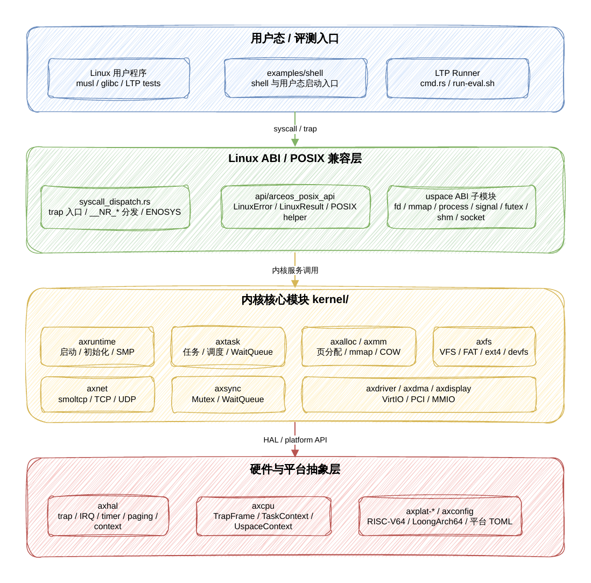
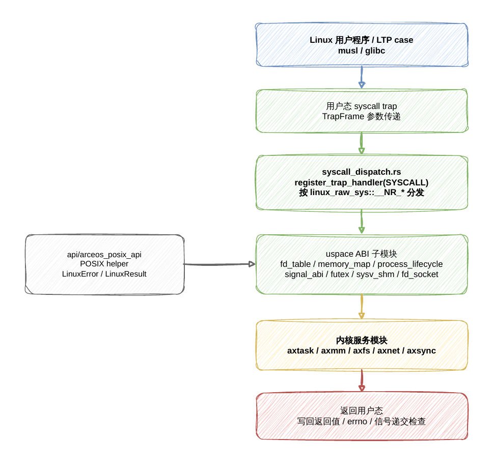
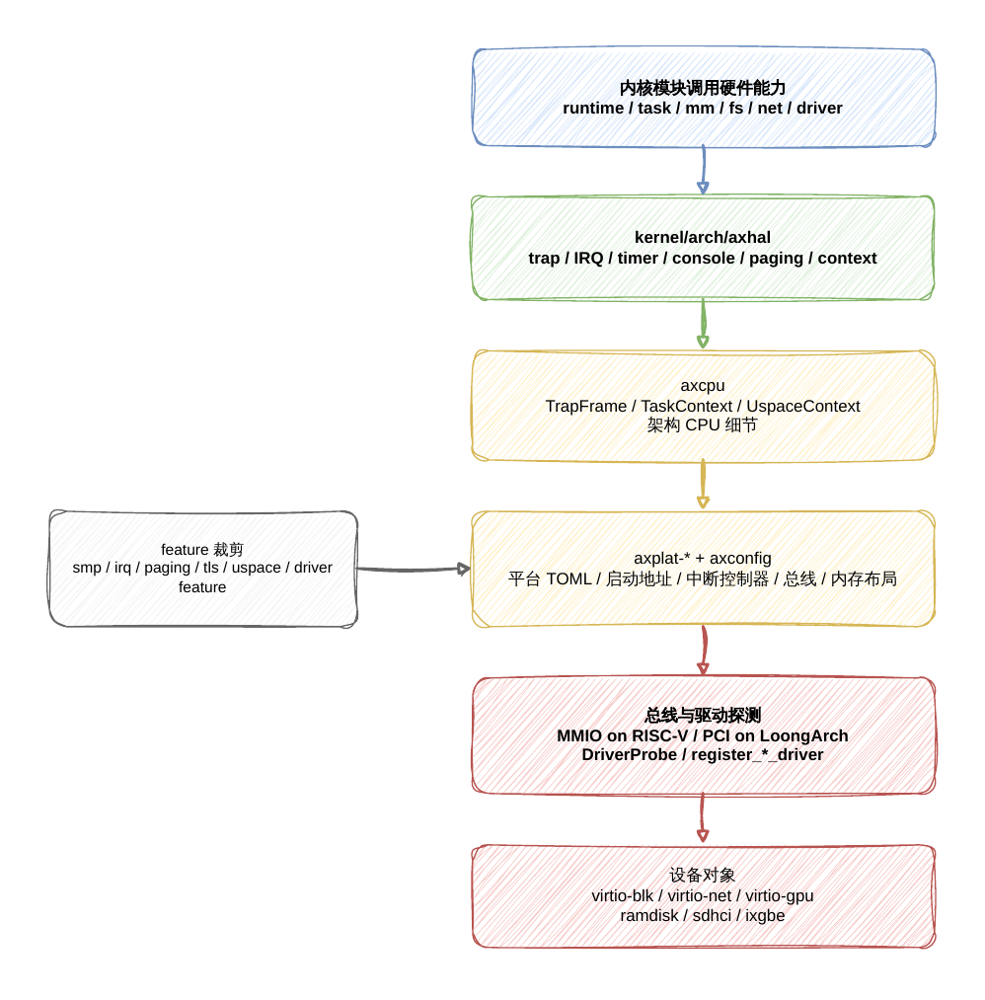
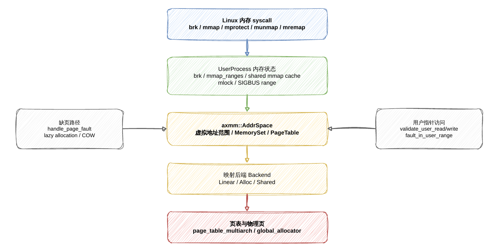
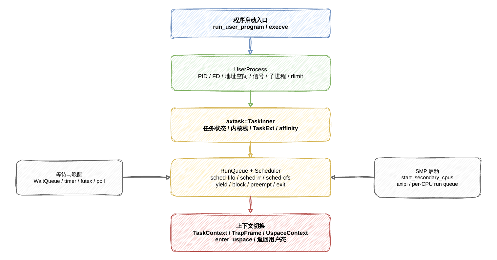
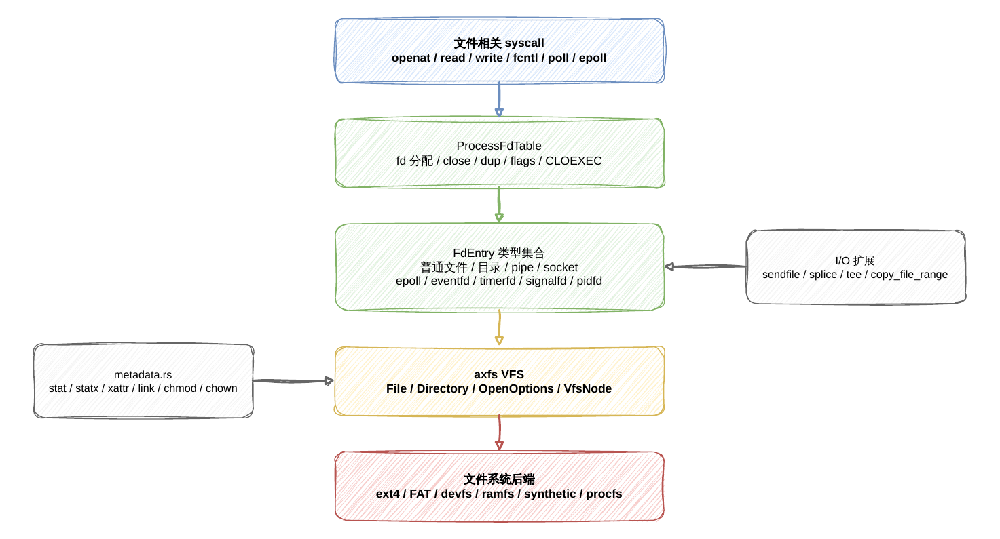
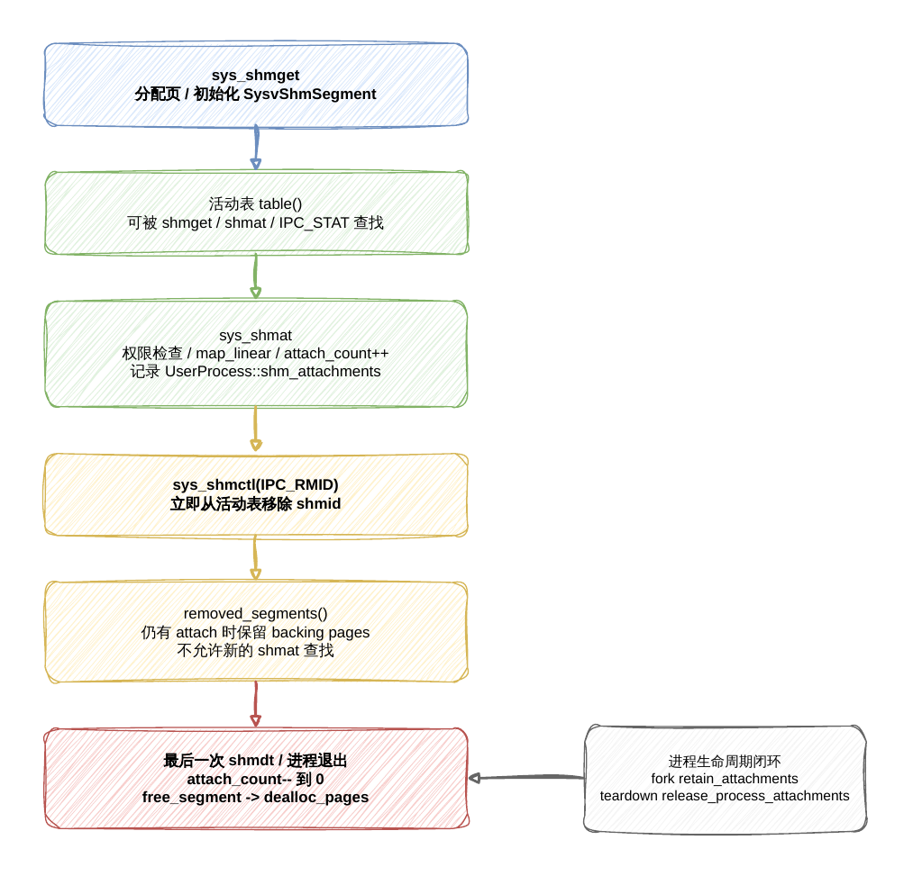
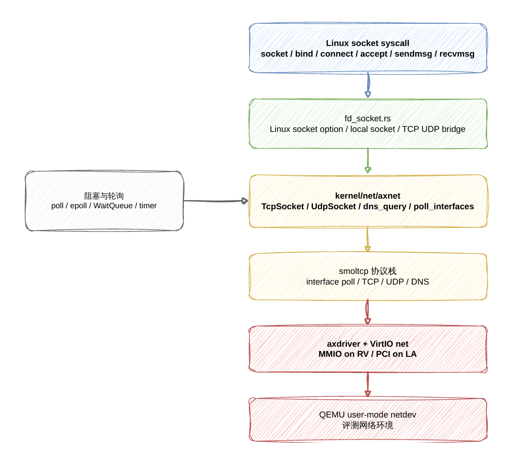

<div class="cover">
  <div class="cover-title">操作系统内核设计</div>
  <div class="cover-project">OrayS</div>
  <div class="cover-meta">杭州电子科技大学<br>2026 年 6 月</div>
</div>

## 摘要

OrayS 是一个基于 ArceOS 的实验性模块化操作系统内核分支，保留了 ArceOS 的 workspace 与 feature 组合机制，同时加入了模块化思想，补充了 Linux/POSIX 用户态边界、ELF 加载、进程生命周期、文件描述符、信号、futex、mmap、socket 和 LTP runner 等能力。

项目继承 ArceOS 多架构框架，重点维护和验证 RISC-V64 与 LoongArch64。

与传统单体 Linux 内核不同，OrayS 在延续 ArceOS 组件化设计的基础上，
进一步引入模块化架构抽象思想：通过 HAL、平台配置、feature 裁剪和清晰的
crate 边界，将硬件抽象、内存、任务调度、文件系统、网络、同步、运行时和
POSIX API 等能力拆分为相对独立、可组合的模块。


## 目录

1. 系统概述
2. 内存管理模块
3. 任务与用户进程管理模块
4. 文件系统与文件描述符模块
5. 信号与 IPC 模块
6. 网络模块
7. 总结与展望
8. AI 工具使用情况

## 第 1 章 系统概述

### 1.1 整体架构




### 1.2 代码结构
```text
OrayS
├── api                         // API 层与 feature 组合
│   ├── axfeat                  // 顶层 feature 配置
│   ├── arceos_api              // ArceOS 公共 API
│   └── arceos_posix_api        // POSIX / Linux 兼容 API helper
│       └── src
│           ├── imp             // POSIX API 实现层
│           ├── signal.rs       // 信号接口桥接
│           ├── utils.rs        // errno 与 syscall 辅助逻辑
│           └── lib.rs          // API 导出入口
├── kernel                      // 内核核心模块
│   ├── arch
│   │   └── axhal               // 硬件抽象层
│   ├── config
│   │   └── axconfig            // 配置模块
│   ├── diagnostics
│   │   └── axlog               // 日志模块
│   ├── drivers
│   │   ├── axdisplay           // 显示模块
│   │   ├── axdma               // DMA 模块
│   │   └── axdriver            // 驱动模块
│   ├── fs
│   │   └── axfs                // 文件系统模块
│   ├── memory
│   │   ├── axalloc             // 内存分配模块
│   │   └── axmm                // 内存管理模块
│   ├── namespace
│   │   └── axns                // namespace / thread-local 资源管理模块
│   ├── net
│   │   └── axnet               // 网络模块
│   ├── runtime
│   │   └── axruntime           // 运行时模块
│   ├── smp
│   │   └── axipi               // IPI / 多核辅助模块
│   ├── sync
│   │   └── axsync              // 同步模块
│   └── task
│       └── axtask              // 任务调度模块
├── user                        // 用户态程序与兼容运行环境
│   └── shell                   // shell、Linux 用户态执行环境与评测 runner
│       └── src
│           ├── cmd.rs          // 测例选择与 runner 集成
│           └── uspace          // Linux syscall / ABI 主实现
├── ulib                        // 用户库
│   ├── axlibc                  // libc 支持
│   └── axstd                   // Rust 用户态标准库封装
├── configs                     // 平台配置
│   ├── platforms               // 本地平台配置
│   └── remote-eval             // 远程评测平台配置
├── scripts                     // 构建与评测辅助脚本
├── tools
│   └── bin                     // 离线 helper 与构建 shim
├── cargo-home                  // 离线 Cargo 配置
└── vendor                      // 离线依赖闭包
```

### 1.3 组件化与模块化设计

OrayS 使用 Cargo workspace 与 feature 机制组合内核能力，`api/axfeat` 将 CPU、
中断、内存、任务、文件系统、网络、显示、驱动和日志等能力抽象为可选 feature。

例如：

- `alloc` 启用动态内存分配。
- `paging` 启用页表操作。
- `multitask` 启用任务和调度器。
- `sched-fifo`、`sched-rr`、`sched-cfs` 选择调度算法。
- `fs`、`net`、`display` 分别启用文件系统、网络和图形栈。
- `bus-mmio`、`bus-pci` 和各类 driver feature 控制设备探测与驱动。

模块化架构抽象层主要由 `axhal`、`axplat`、`axcpu` 和 `axconfig` 共同构成。
`kernel/arch/axhal` 面向内核其他子系统提供稳定的硬件抽象接口，包括内存区域枚举、per-CPU 初始化、时钟、IRQ、console、trap 分发、上下文结构和
页表类型等。这些接口不直接绑定某一个硬件平台，而是通过 `axplat` 平台 crate 接入具体实现：默认构建会按目标架构链接 `axplat-x86-pc`、`axplat-aarch64-qemu-virt`、
`axplat-riscv64-qemu-virt` 或 `axplat-loongarch64-qemu-virt`。

架构相关 CPU 细节由 `axcpu` 承担，`axhal` 只重新导出内核需要使用的统一入口。
例如 trap 常量、`register_trap_handler`、`TaskContext`、`TrapFrame` 和 `UspaceContext` 都通过 `axhal::trap` / `axhal::context` 暴露给上层。页表实现也采用同一抽象：开启 `paging` feature 后，`axhal::paging::PageTable` 会根据目标架构选择 x86_64、RISC-V、AArch64 或 LoongArch64 对应的 `page_table_multiarch` 后端。

平台能力通过 feature 和配置共同裁剪。`axhal/Cargo.toml` 将 `smp`、`irq`、
`fp-simd`、`rtc`、`paging`、`tls`、`uspace` 等能力映射到对应平台 crate 或
CPU 支持库；`axconfig` 则把 TOML 平台配置转为编译期常量，供 runtime、HAL、driver 和链接脚本使用。不同架构和平台主要在平台 crate、构建 feature 与配置文件层面切换启动地址、中断控制器、设备总线和内存布局，上层内核模块保持统一接口。

运行时层面，OrayS 主要依赖 `kernel/runtime/axruntime` 完成模块初始化、驱动发现、文件系统挂载、网络初始化和多核启动，再由 `kernel/task/axtask`、`WaitQueue`、timer、futex、poll/epoll、socket 阻塞唤醒等机制支撑 Linux 用户态的等待与非同步 I/O 语义。

### 1.4 Linux/POSIX 接口设计


OrayS 的用户态兼容层面向 POSIX/Linux 应用兼容运行场景，整体上分为可复用 POSIX API 辅助层和评测入口下的 Linux ABI 适配层两部分。

`api/arceos_posix_api` 提供相对通用的 POSIX API helper，用于抽象常见用户态接口的基础语义。该层按 feature 暴露 `read`、`write`、`open`、`stat`、`fcntl`、`select`、`epoll`、`socket`、`pipe`、`pthread`、`clock_gettime`、`nanosleep` 等接口，并统一使用 `LinuxError` / `LinuxResult` 表达 Linux errno 语义，为上层兼容实现提供一致的错误处理和接口封装基础。

`user/shell/src/uspace` 则承担当前评测路径中的 Linux ABI 适配入口。由于 OS 比赛评测程序直接运行在 shell 用户态环境中，该目录内集中实现了 syscall trap 入口、系统调用分发、用户指针访问、进程上下文维护以及若干 Linux 特有 ABI 兼容逻辑。系统通过 `register_trap_handler(SYSCALL)` 注册用户态 syscall 入口，并依据 `linux_raw_sys::general::__NR_*` 将不同 syscall 分发到对应子模块中处理。

其中，`fd_table.rs` 负责文件描述符表、文件读写、目录、管道、epoll、sendfile、splice 等文件与 I/O 相关 ABI；`memory_map.rs` 负责 `brk`、`mmap`、`mprotect`、`mremap`、`munmap`、`mlock` 等地址空间接口；`process_lifecycle.rs` 负责 `clone`、`execve`、`wait4`、`waitid`、`exit`、`exit_group` 等进程生命周期；`signal_abi.rs` 负责信号安装、屏蔽、返回与发送；`fd_socket.rs` 负责 TCP/UDP socket、本地 socket 以及 socket option 兼容；`futex.rs`、`sysv_msg.rs`、`sysv_sem.rs`、`sysv_shm.rs`、`posix_mq.rs` 提供同步与 IPC 支持；`metadata.rs`、`mount_abi.rs`、`resource_sched.rs`、`time_abi.rs`、`credentials.rs` 分别处理文件元数据、挂载、资源限制、调度、时间和凭据相关 ABI。

这种组织方式的目标是先保证 Linux 应用在评测入口下形成完整的 syscall 闭环：未知 syscall 统一返回 `ENOSYS`，用户指针读写集中由 `user_memory.rs` 等 helper 处理，避免裸指针访问散落在各个实现中；各 syscall 子模块则围绕 Linux ABI 语义逐步补齐 errno 优先级、边界条件、资源限制和跨架构差异。

当前该层仍保留一定的评测入口耦合，主要原因是 Linux ABI 兼容逻辑需要同时依赖 shell 运行时、用户进程上下文、文件描述符表、信号状态和内存映射状态。后续演进方向是将已经稳定的 syscall 语义、fd 管理、用户内存访问、进程/信号/IPC 等能力进一步拆分为更清晰的内核服务模块或公共兼容库，使 `user/shell/src/uspace` 逐步退化为轻量级入口和适配胶水层，而不是长期承载完整 ABI 实现。

### 1.5 中断与异常处理架构

Trap 分发由 `axcpu` crate 提供框架，通过 `axhal::trap` 模块重新导出四个 trap 类型常量：

| 常量 | 用途 | 注册方式 |
|------|------|---------|
| `IRQ` | 硬件中断 | `register_trap_handler(IRQ)` 注册处理函数 |
| `PAGE_FAULT` | 缺页异常 | `register_trap_handler(PAGE_FAULT)` 注册处理函数 |
| `SYSCALL` | 用户态系统调用 | `register_trap_handler(SYSCALL)` 注册处理函数 |
| `USER_EXCEPTION` | 用户态其他异常 | 需 `uspace` feature，按用户异常入口分发 |

这些 trap 类型由 `axcpu::trap` 的 `register_trap_handler` 属性宏在链接时将处理函数指针放入特定 section，平台 trap 入口遍历这些 section 完成分发。`axcpu::trap` 还提供 `register_user_return_handler` 注册从内核返回用户态前的回调（用于信号递交检查）。

IRQ 处理的核心是 `irq_handler(vector)`：以 `kernel_guard::NoPreempt::new()` 创建抢占禁用守卫，调用 `axplat::irq::handle(vector)` 执行已注册的中断处理函数，守卫析构时恢复抢占状态并可能触发重调度。返回值 `true` 表示已处理。

定时器中断在 `init_interrupt()` 中注册。使用 percpu 变量 `NEXT_DEADLINE` 维护下次定时器触发时刻。

每次中断到来时，计算下一个周期截止时间（基于 `PERIODIC_INTERVAL_NANOS = NANOS_PER_SEC / TICKS_PER_SEC`），调用 `axhal::time::set_oneshot_timer()` 编程硬件定时器，随后调用 `axtask::on_timer_tick()` 驱动调度器时钟滴答。

此设计使用 oneshot 模式而非周期模式：允许其他子系统设置更早的单次定时器而不推迟调度 tick，截止时间保持不变避免频繁精确唤醒将 tick 无限推迟。

IPI 中断（核间中断）在 `init_interrupt()` 中注册，处理函数调用 `axipi::ipi_handler()` 执行其他 CPU 请求的回调。

缺页异常由 `AddrSpace::handle_page_fault()` 处理，详细处理会在后续文档中介绍。

系统调用的 trap 处理函数 `user_syscall` 注册在 `user/shell/src/uspace/syscall_dispatch.rs`。处理流程：获取当前 `UserProcess` 引用 → 检查 eval watchdog 和 `exit_group` 状态 → 按 `syscall_num` 匹配当前分发表中的 `__NR_*` 条目 → 调用对应的 `sys_*` 实现 → 未匹配者返回 `ENOSYS` → 将返回值写入 trap frame 的寄存器 → 返回用户态前检查待处理信号。

### 1.6 设备驱动模型



设备驱动采用基于 feature 的静态注册 + trait 探测模型。

核心 trait `DriverProbe` 定义在 `kernel/drivers/axdriver/src/drivers.rs`，提供三种探测方法：

- `probe_global()` — 无条件创建设备（如 ramdisk）[参见: `kernel/drivers/axdriver/src/drivers.rs:16`]
- `probe_mmio(mmio_base, mmio_size)` — 在指定 MMIO 地址范围探测（用于 VirtIO MMIO 设备）[参见: `kernel/drivers/axdriver/src/drivers.rs:21`，仅在 `bus = "mmio"` 时编译]
- `probe_pci(root, bdf, dev_info)` — 在指定 PCI 设备功能上探测（用于 VirtIO PCI 或 ixgbe 等 PCI 设备）

每个探测方法都有默认返回 `None` 的实现，各驱动只覆写自身支持的探测方式。

驱动注册宏定义在 `kernel/drivers/axdriver/src/macros.rs`：
- `register_block_driver!(DriverType, DeviceType)` — 注册块设备驱动
- `register_net_driver!(DriverType, DeviceType)` — 注册网络设备驱动
- `register_display_driver!(DriverType, DeviceType)` — 注册显示设备驱动

这些宏定义统一的设备类型别名（如 `AxNetDevice`），并配合 `for_each_drivers!` 宏在总线扫描时自动枚举所有已注册驱动类型。`for_each_drivers!` 内部按 `cfg` feature（`net_dev = "virtio-net"`、`block_dev = "virtio-blk"` 等）条件编译，每个启用的驱动展开为一段代码块，在其中调用对应的 probe 方法。

MMIO 总线扫描在 `AllDevices::probe_bus_devices()` 中实现：遍历 `axconfig::devices::VIRTIO_MMIO_RANGES` 配置中每个地址范围，对每个已注册驱动尝试 `probe_mmio()`，匹配成功则通过 `self.add_device(dev)` 注册。

PCI 总线扫描通过 `config_pci_device()` 配置 BAR 空间，随后调用驱动的 `probe_pci()` 匹配 Vendor ID / Device ID。

在 `drivers.rs` 中可以看到当前项目的驱动使用情况：virtio-blk、virtio-net、virtio-gpu、ramdisk、bcm2835-sdhci、ixgbe。RISC-V 评测路径使用 MMIO 总线 + virtio，LoongArch 评测路径使用 PCI 总线 + virtio。

### 1.7 内核同步原语

OrayS 提供多层同步机制，组合覆盖不同场景。

第一层：关闭中断的自旋锁 — `kspin::SpinNoIrq<T>`。在获取锁时禁用本地 CPU 中断，释放时恢复。用于保护中断上下文与任务上下文共享的数据。全局分配器的 `palloc` 字段和运行队列的锁均使用此类型。

第二层：阻塞互斥锁 — `axsync::Mutex<T>`（基于 `RawMutex`）。当锁已被持有时，当前任务阻塞并加入等待队列，释放锁时唤醒等待者。`RawMutex` 的核心字段：
- `wq: WaitQueue` — 等待队列
- `owner_id: AtomicU64` — 持有者任务 ID（0 表示未锁定）

`lock()` 方法使用 CAS 循环尝试获取所有权，失败时调用 `self.wq.wait_until(|| !self.is_locked())` 阻塞。`try_lock()` 使用单次 strong CAS [参见: `kernel/sync/axsync/src/mutex.rs:66`]。`unlock()` 将 `owner_id` 清零并通过 `wq.notify_one(true)` 唤醒一个等待者。

第三层：等待队列 — `axtask::WaitQueue`。提供 `wait_until(condition)` 阻塞当前任务直到条件满足，以及 `notify_one(resched)` / `notify_all(resched)` 唤醒等待者。运行队列的 `blocked_resched()` [参见: `kernel/task/axtask/src/run_queue.rs:409-438`] 负责将当前任务状态设为 `Blocked`、放入等待队列、释放等待队列锁、触发重调度。调用方需持有等待队列的 `SpinNoIrq` 锁：`blocked_resched` 内部注释说明期望的抢占禁用计数为 2（1 来自 `NoPreemptIrqSave`，1 来自等待队列的 `SpinNoIrq`）。

第四层：抢占控制 — `kernel_guard::NoPreempt`。RAII 守卫，构造时递增当前任务的 `preempt_disable_count`，析构时递减并在归零时检查 `need_resched` 标志并可能触发抢占式重调度 [参见: `kernel/task/axtask/src/run_queue.rs:335`]。IRQ handler 中用于包裹整个中断处理期间禁止抢占。调度器操作通常使用更严格的 `NoPreemptIrqSave`（禁用抢占 + 关闭中断的组合守卫）。

LoongArch 页表特化：在 LoongArch 上，`MappingFlags` 有一个特殊处理——对于 `USER` 但无 `READ|WRITE|EXECUTE` 的页（如 `PROT_NONE` 映射），改为设置 `READ` 标志保持页表项存在，但移除用户态可访问性，使 PLV3 访问触发 trap 转为 SIGSEGV。


## 第 2 章 内存管理模块



### 2.1 全局分配器

`kernel/memory/axalloc` 提供全局分配器 `GlobalAllocator`。它由两层组成：

- 字节分配器：可通过 feature 选择 TLSF、slab 或 buddy。
- 页分配器：使用 `BitmapPageAllocator<PAGE_SIZE>` 管理物理页帧。

分配器初始化时从可用物理内存区域中选出主 heap 区域，先分配 32 KiB 初始化
字节分配器，再把其他空闲区域加入全局 allocator。当前实现还对页大小及以上的
短生命周期大对象使用 direct page allocation，避免长期 LTP 运行中大量 task stack、
页表辅助缓冲和 ELF 加载 scratch buffer 永久推高字节 heap。

### 2.2 地址空间与页表

`kernel/memory/axmm` 以 `AddrSpace` 表示虚拟地址空间，内部维护：

- `VirtAddrRange`：地址空间范围。
- `MemorySet<Backend>`：按区域组织的映射元数据。
- `PageTable`：实际页表。

内核地址空间由 `new_kernel_aspace()` 创建，并按 `axhal::mem::memory_regions()`
线性映射物理内存区域。用户地址空间由 `new_user_aspace()` 创建；在不使用独立
用户页表根的架构上，会复制内核部分映射。在 AArch64 和 LoongArch64 上，用户
页表与内核页表采用架构独立机制，因此不需要复制内核半区映射。

### 2.3 映射后端

`axmm` 的 `Backend` 支持三类映射：

| 后端 | 用途 |
| --- | --- |
| `Linear` | 已知物理地址的线性映射，常用于内核或设备相关区域。 |
| `Alloc` | 普通匿名映射；可选择创建时 populate，或在缺页时 lazy allocation。 |
| `Shared` | 共享物理页映射，用于 fork/vfork 场景下的共享或 COW 元数据。 |

`clone_user_mappings_from()` 用于 fork 类场景：复制用户映射元数据，保留已有
物理页引用，并把可写页在父子两侧写保护，后续写入通过缺页路径完成 COW。
`share_user_mappings_from()` 用于 vfork 类场景：子进程拥有独立页表，但 resident
可写页仍映射到相同物理帧，保证子进程 exec/exit 前的行为符合 vfork 共享语义。

### 2.4 用户态内存接口

`user/shell/src/uspace/memory_map.rs` 在 Linux ABI 层实现用户可见的内存管理：

- `brk` 维护进程堆边界。
- `mmap` 支持匿名映射和文件后端映射。
- `mprotect`、`munmap`、`mremap` 调整已有映射。
- `msync`、`madvise`、`mincore`、`mlock`、`mlockall` 等提供 LTP 所需兼容语义。

用户进程的 `UserProcess` 保存 `AddrSpace`、`brk` 状态、mmap 区间、共享 mmap
缓存、SIGBUS 区间、mlock 统计和文件后端映射信息。系统调用访问用户缓冲区时
通过 `user_memory.rs` 的读写函数进入地址空间，统一处理权限、越界、懒分配和
COW 相关情况。


### 2.5 缺页异常处理流程

缺页异常（Page Fault）是用户态内存管理的核心机制，支持惰性分配（lazy allocation）和写时复制（COW）。

入口为 `AddrSpace::handle_page_fault(vaddr, access_flags) → bool`。处理步骤：

1. 检查 `vaddr` 是否在地址空间的 `va_range` 内
2. 在 `MemorySet` 中查找包含该地址的 `MemoryArea`
3. 验证区域原始标志 `orig_flags` 是否包含访问所需的权限位
4. 调用后端的 `handle_page_fault()` 执行具体处理

后端层的处理逻辑位于 `kernel/memory/axmm/src/backend/mod.rs`：

- Linear 后端：线性映射不应触发缺页，直接返回 `false`
- Alloc 后端：调用 `handle_page_fault_alloc()` —— 若为惰性映射（`populate=false`）则为该页分配物理帧并建立页表项；若为 populate 模式则不应缺页
- Shared 后端：调用 `handle_page_fault_shared()` —— 若页在共享页集中已存在则复用；若 `alloc_missing=true` 则分配新帧

COW（写时复制）的完整链路：`clone_user_mappings_from()` 在 fork 时将父子两侧的可写页标记为写保护 [参见: `kernel/memory/axmm/src/aspace.rs:110`]。后续任一侧写入触发缺页，`Shared` 后端的 `handle_page_fault_shared()` 在检测到写保护页时分配新物理帧、复制数据、更新页表项为可写，并释放对原共享帧的引用。

用户态内存访问 helper 实现位于 `user/shell/src/uspace/user_memory.rs`。`validate_user_read()` / `validate_user_write()` / `fault_in_user_read()` / `fault_in_user_write()` 均最终调用 `fault_in_user_range()`，该函数执行以下验证和预处理：

1. 空指针和溢出检查，返回 `EFAULT`
2. 检查是否跨越未提交的 brk 边界
3. 按页遍历访问范围，调用 `handle_mmap_grow_down_fault()` 处理 MAP_GROWSDOWN 栈扩展
4. 调用 `aspace.can_access_range()` 验证权限
5. 调用 `aspace.populate_range()` 提前建立惰性页映射，避免内核态 `AddrSpace::read/write` 时缺页

`read_user_bytes()` / `write_user_bytes()` 在 `fault_in` 后再通过 `AddrSpace::read/write` 进行实际的内核态数据拷贝，从而模拟 Linux `copy_from_user`/`copy_to_user` 语义。


## 第 3 章 任务与用户进程管理模块



### 3.1 内核任务模型

`kernel/task/axtask` 提供内核任务抽象。核心结构 `TaskInner` 包含任务 ID、名称、
状态、CPU affinity、CPU ID、等待队列、退出码、内核栈、上下文和 task extension。
任务状态包括：

- `Running`
- `Ready`
- `Blocked`
- `Exited`

`axtask` 的调度器由 feature 选择：

- `sched-fifo`：FIFO 协作式调度。
- `sched-rr`：Round-robin 抢占式调度。
- `sched-cfs`：CFS 抢占式调度。

在 SMP feature 打开时，运行队列按 CPU 组织，并根据 CPU affinity 和简单的
round-robin 选择目标 run queue。本评测内核默认 `KERNEL_SMP=1`，但底层仍保留
多核运行队列和 affinity 设计。

### 3.2 用户进程对象

`user/shell/src/uspace/mod.rs` 中的 `UserProcess` 是 Linux ABI 层的用户进程
对象。它在一个结构内集中维护评测用户态所需的 Linux 可见状态，包括：

- 地址空间、`brk`、mmap 区间和共享映射缓存。
- 文件描述符表、当前工作目录、根目录、exec 路径。
- 子进程列表、wait queue、退出码、线程计数。
- PID、PGID、SID、PPID 和进程组/会话相关状态。
- uid/gid、groups、capability、personality、umask。
- 信号 action、pending signal、altstack 和 syscall restart 相关状态。
- rlimit、调度策略、nice、ioprio、timer slack、POSIX timer。
- 路径元数据缓存、xattr、硬链接/软链接、稀疏文件数据等兼容状态。
- SysV shared memory attachment、futex、评测 watchdog 等运行状态。

这种设计把底层 `axtask` 的任务调度能力与 Linux 用户态进程语义分开：内核任务
负责执行和调度，`UserProcess` 负责 Linux ABI 中进程可观察状态的维护。

### 3.3 进程生命周期

`process_lifecycle.rs` 负责用户进程生命周期：

- `run_user_program()` / `run_user_program_in_timeout()` 供 shell 和 runner 启动程序。
- `execve` 通过 ELF loader 重建地址空间、加载程序段并更新 task context。
- `clone` 根据 flags 选择线程、fork 或 vfork 类语义，并设置子任务 trap frame。
- `wait4` / `waitid` 回收子进程并返回 Linux wait status。
- `exit` / `exit_group` 处理线程退出、进程组退出和资源释放。

为了支撑长时间 LTP，用户任务内核栈设置为 64 KiB，避免复杂 glibc 网络、文件和
用户拷贝路径在较小内核栈上溢出。进程创建前还会检查空闲页帧阈值，降低 fork
压力下的资源耗尽风险。


### 3.4 上下文切换机制

OrayS 的上下文切换依赖 `axcpu` crate 提供的三种上下文结构：

- `TaskContext` — 任务上下文，保存被切换任务的 callee-saved 寄存器（各架构定义不同）。调度器在 `resched()` 中调用平台提供的切换函数。
- `TrapFrame` — 异常/中断帧，保存 trap 进入内核时的完整寄存器快照。由平台 trap 入口在栈上构建。
- `UspaceContext` — 用户/内核态切换上下文，仅在 `uspace` feature 下可用。封装了从内核态进入用户态所需的寄存器状态设置和地址空间切换。

用户态进入流程：`user_task_entry()` 从 `TaskExt` 中取出初始化时保存的 `UspaceContext`，获取内核栈顶地址，然后调用 `context.enter_uspace(kstack_top)`。此函数由 `axcpu` 在各架构的 platform crate 中实现，负责：设置用户页表根、恢复用户态寄存器、执行 `sret`（RISC-V）/`eret`（AArch64）/`ertn`（LoongArch）等架构特定的返回指令。

调度上下文切换发生在 `run_queue.rs` 的多个位置：`yield_current()`、`exit_current()`、`blocked_resched()` 和 `preempt_resched()`。这些函数最终调用 `self.inner.resched()` 触发任务切换，由 `axsched` crate 选择下一个就绪任务并执行 `TaskContext` 切换。

抢占触发路径：`preempt_resched()` 中检查 `curr.can_preempt(1)`，允许抢占时调用 `self.inner.resched()` 切换任务；不允许时设置 `preempt_pending` 标志，等待 `enable_preempt`（即 `NoPreempt` 守卫析构）时再次检查并触发。

### 3.5 SMP 多核启动与核间通信

AP（Application Processor）启动由 `start_secondary_cpus(primary_cpu_id)` 完成。启动流程：

1. 遍历所有 CPU ID（0 到 `axhal::cpu_num() - 1`），跳过 BSP
2. 为每个 AP 分配独立的启动栈（`SECONDARY_BOOT_STACK`，大小 = `axconfig::TASK_STACK_SIZE`，类型为 `[[u8; TASK_STACK_SIZE]; MAX_CPU_NUM - 1]`
3. 调用 `axhal::power::cpu_boot(i, stack_top)` 向硬件发送核间中断或写启动地址寄存器
4. 自旋等待 `ENTERED_CPUS` 计数器递增，确认 AP 已进入内核

AP 入口为 `rust_main_secondary(cpu_id)`：

1. `axhal::init_percpu_secondary(cpu_id)` — 初始化 AP 的 percpu 数据
2. `axhal::init_early_secondary(cpu_id)` — AP 早期平台初始化
3. 递增 `ENTERED_CPUS` 通知 BSP
4. `axmm::init_memory_management_secondary()` — 初始化 AP 的内存管理（复用内核页表）
5. `axhal::init_later_secondary(cpu_id)` — AP 后期平台初始化
6. `axtask::init_scheduler_secondary()` — 为 AP 创建本地运行队列
7. `axipi::init()` — 初始化 IPI 子系统
8. 递增 `INITED_CPUS`
9. 等待所有 CPU 完成初始化
10. 使能 IRQ
11. 进入 `axtask::run_idle()` — 运行 idle 任务，从本地运行队列取任务执行

IPI（核间中断）通过 `axipi` crate 提供 [参见: `kernel/smp/axipi/src/lib.rs`]：

- `run_on_cpu(dest_cpu, callback)` — 在指定 CPU 上执行回调
- `run_on_each_cpu(callback)` — 在所有 CPU 上执行回调
- `ipi_handler()` — IPI 中断的 ISR，消费 IPI 事件队列并执行回调

IPI 事件通过 `IpiEvent` 封装，使用无锁队列在线程间传递。回调类型包括单播 `Callback`（`Box<dyn FnOnce()>`）和多播 `MulticastCallback`（`Arc<dyn Fn()>`）。


## 第 4 章 文件系统与文件描述符模块



### 4.1 VFS 与后端文件系统

`kernel/fs/axfs` 提供统一文件系统操作。它通过 VFS node 抽象隐藏 FAT、ext4、
devfs、ramfs 等后端差异，并向上提供 `File`、`Directory` 和 `OpenOptions` 等
低层文件操作对象。

主要 feature 包括：

- `fatfs`：使用 FAT 作为主文件系统。
- `ext4fs`：使用 ext4 作为主文件系统；比赛镜像路径默认启用并以只读为主。
- `devfs`：在 `/dev` 挂载设备文件系统。
- `ramfs`：在 `/tmp` 挂载内存文件系统。
- `myfs`：允许应用提供自定义文件系统初始化逻辑。

`File` 对象维护 VFS node、权限能力和文件 offset。`Directory` 对象维护目录 node
和 `read_dir` 游标。打开、读写、截断、seek 等基础操作均通过 VFS node 完成。

### 4.2 Linux 文件描述符层

Linux ABI 层的 FD 实现在 `user/shell/src/uspace/fd_table.rs`、`fd_pipe.rs`、
`fd_socket.rs` 等文件中。它把不同对象统一放入进程级 `ProcessFdTable`：

- 普通文件和目录。
- pipe 读端/写端。
- TCP/UDP socket 与本地 socket。
- epoll、eventfd、timerfd、signalfd、memfd 等评测所需特殊 fd。
- pidfd 和部分 inotify/ioctl/fcntl 兼容处理。

系统调用层实现了 `openat`、`openat2`、`close`、`close_range`、`read`、`write`、
`readv`、`writev`、`preadv2`、`pwritev2`、`lseek`、`fcntl`、`flock`、`fsync`、
`getdents64`、`sendfile`、`splice`、`tee`、`vmsplice`、`copy_file_range` 等接口。
所有接口都以 Linux errno 和用户指针读写语义为边界，避免将评测 wrapper 的 PASS
输出与真实内核语义混淆。

### 4.3 文件元数据与合成文件

`user/shell/src/uspace/metadata.rs` 和 `user/shell/src/uspace/synthetic_fs.rs` 补齐评测中常见的 Linux 文件元数据行为，包括：

- `stat` / `newfstatat` / `statx` / `statfs` / `fstatfs`。
- chmod/chown/umask/access/utimensat。
- symlink/hardlink/readlink。
- xattr 设置、读取、枚举和删除。
- `/proc`、`/sys`、部分设备节点和进程状态合成 [参见: `user/shell/src/uspace/synthetic_fs.rs`]。

这些兼容状态并不替代真实 VFS 后端，而是在当前评测模型下为 Linux 用户程序
提供可观察的一致行为。

## 第 5 章 信号与 IPC 模块

### 5.1 信号处理

`signal_abi.rs` 实现 Linux real-time signal 相关 ABI。当前支持的主要接口包括：

- `rt_sigaction`
- `rt_sigprocmask`
- `rt_sigpending`
- `rt_sigsuspend`
- `rt_sigtimedwait`
- `rt_sigreturn`
- `sigaltstack`
- `kill`
- `tkill`
- `tgkill`
- `pidfd_send_signal`

系统调用返回用户态前会检查待处理信号，并按进程/线程的 signal mask、action、
默认动作和 syscall restart 状态决定返回值或切换到用户 signal handler。`api` 层还
提供 `PosixSignalIf` 接口，使 pipe/socket 等通用 POSIX helper 可以触发 SIGPIPE
这类用户可见信号语义。

### 5.2 futex 与等待机制

`futex.rs` 提供用户态同步所需的 futex 兼容层，结合 `axtask::WaitQueue` 实现等待
和唤醒。`task_context.rs` 维护 robust list、TID 地址、用户 trap frame 和 task
extension，支撑 pthread、clone、exit 和用户态同步相关测试。

### 5.3 IPC



OrayS 在 Linux ABI 层提供多种 IPC：

- `fd_pipe.rs`：pipe/pipe2，支持阻塞、非阻塞、poll/epoll 和 SIGPIPE 语义
- `posix_mq.rs`：POSIX message queue
- `sysv_msg.rs`：System V message queue
- `sysv_sem.rs`：System V semaphore
- `sysv_shm.rs`：System V shared memory
- `fd_socket.rs`：socketpair 和本地 socket 兼容路径

这些模块围绕 LTP 和官方评测需求实现 Linux 可见行为，重点保证 errno、阻塞、
唤醒、资源释放和进程退出后的清理语义真实可审计。

### 5.4 System V 共享内存生命周期

共享内存的生命周期管理是 System V IPC 实现中的关键问题：`IPC_RMID` 需要让共享内存标识符立即失效，避免后续进程再次通过旧 `shmid` 附加；但已经 `shmat` 的进程仍应能继续访问原有映射，直到最后一次 `shmdt` 或进程退出后才释放物理页。OrayS 在 `user/shell/src/uspace/sysv_shm.rs` 中采用“立即移除标识符 + 按附加计数延迟释放”的策略。

当前实现维护两张全局表：

- `table()`：活动共享内存表，保存仍可被 `shmget`、`shmat`、`shmctl(IPC_STAT)` 等接口查找的 `SysvShmSegment`。
- `removed_segments()`：已执行 `IPC_RMID` 但仍有进程附加的段。它不再参与新的 `shmat` 查找，只用于等待已有映射全部释放。

共享内存段创建时，`sys_shmget` 通过 `global_allocator().alloc_pages()` 分配物理页并清零，记录 `key`、权限、创建者、请求大小、实际页对齐大小和 `backing_vaddr`。`sys_shmat` 只从活动表中查找段，完成权限检查后把同一组物理页通过 `aspace.map_linear()` 映射到调用进程地址空间，并在 `UserProcess::shm_attachments` 中记录用户虚拟地址到 `(shmid, size)` 的关系。

`sys_shmctl(IPC_RMID)` 的删除路径会先检查 `shmid` 是否仍在活动表中，再校验调用者是否为 root、owner 或 creator。通过检查后，段会立即从活动表移除：

```rust
fn remove(shmid: i32) {
    if let Some(segment) = table().lock().remove(&shmid) {
        if segment.attach_count == 0 {
            free_segment(segment);
        } else {
            removed_segments().lock().insert(shmid, segment);
        }
    }
}
```

这种处理带来两个直接效果。第一，`IPC_RMID` 之后新的 `shmat` 不会再通过普通查找拿到该段，`/proc/sysvipc/shm`、`SHM_INFO` 等活动视图也不再统计它。第二，已经附加的进程不会因为标识符消失而立刻失效；只要 `attach_count` 仍大于 0，段对象会留在 `removed_segments()` 中，继续支撑已有页表映射。

实际物理页回收发生在最后一次 detach 时。`sys_shmdt` 会先从进程的 `shm_attachments` 删除记录，再调用 `sys_munmap()` 解除用户映射，成功后递减对应段的 `attach_count`。如果该段已经处于 removed 表并且计数降为 0，就移除表项并调用 `free_segment()`：

```rust
if segment.attach_count == 0 {
    if let Some(segment) = removed.remove(&shmid) {
        free_segment(segment);
    }
}
```

进程生命周期也参与资源闭环：`fork`/`clone` 复制 `shm_attachments` 时会通过 `retain_attachments()` 增加计数；进程退出路径 `UserProcess::teardown()` 会调用 `release_process_attachments()`，确保异常退出或未显式 `shmdt` 的进程同样释放引用。这样，OrayS 避免了“删除后仍可重新附加”的语义漏洞，也避免了“还有进程映射时过早释放物理页”的 use-after-free 风险。与基于 `Arc<SharedMemory>` 自动 Drop 的设计思路相似，这里使用的是显式表项所有权迁移和 `attach_count` 驱动的延迟释放，更贴合当前 Linux ABI 层的进程状态管理。

## 第 6 章 网络模块



底层网络模块位于 `kernel/net/axnet`，当前使用 smoltcp 作为网络协议栈。它向上导出：

- `TcpSocket`
- `UdpSocket`
- `dns_query`
- `poll_interfaces`
- `socket_count`

runtime 初始化时，`axruntime` 调用 `axdriver::init_drivers()` 获取网络设备，再由
`axnet::init_network()` 选取一个 NIC 设备初始化协议栈。QEMU 评测路径通常通过 VirtIO 网络设备和 QEMU user-mode netdev 提供网络环境。

Linux ABI 层的 socket 入口位于 `fd_socket.rs`，负责把 Linux `socket`、`bind`、`connect`、`listen`、`accept`、`sendto`、`recvfrom`、`sendmsg`、`recvmsg`、`shutdown`、`getsockname`、`getpeername`、`setsockopt`、`getsockopt` 等接口桥接到底层 TCP/UDP socket 或本地 socket 对象。当前文档只把 IPv4/TCP/UDP 和本地 socket 作为已在评测路径中重点维护的能力；IPv6 和真实物理网卡行为需要
按具体测试结果单独确认。


## 第 7 章 总结与展望

OrayS 当前是一个基于 ArceOS 演进的 OSKernel 2026 评测内核。它的优势在于：

- 保留 ArceOS 的组件化 crate 架构、feature 裁剪和跨架构平台抽象，便于在 RISC-V64、LoongArch64 等目标之间复用核心模块。
- 在 `api/arceos_posix_api` 与 `user/shell/src/uspace` 中形成 Linux/POSIX 兼容边界，覆盖 syscall 分发、用户指针访问、进程、FD、信号、IPC、mmap、futex 和 socket 等关键路径。
- 通过 `axruntime`、`axtask`、`axhal`、`axdriver`、`axfs` 和 `axnet` 串联启动、调度、内存、驱动、文件系统与网络，形成可被评测程序实际运行的内核执行环境。
- 围绕 LTP 建立 runner、summary parser、阶段报告和合规约束，使通过结果、失败原因、timeout、`ENOSYS` 和 panic/trap 都能被追踪和复核。

### 7.1 截至目前的开发规模

从 2026 年 4 月 17 日前的基线提交到当前版本，OrayS 的主要开发规模如下：

- 项目开发提交 **531 次**，覆盖竞赛阶段主要功能、修复、验证和文档提交。
- 仓库总体变更涉及 **566 个文件**，新增 **145,523 行**、删除 **2,849 行**；其中包含 vendor 依赖、测试、脚本和文档。
- 核心源码与构建验证路径涉及 **246 个文件**，新增 **70,590 行**、删除 **883 行**，主要集中在 `kernel/`、`api/`、`ulib/`、用户态入口、`scripts/`、`configs/` 和根构建文件。
- Linux syscall dispatcher 已注册 **231 个唯一 syscall 编号**，形成较完整的 Linux ABI 入口基础。
- 用户态兼容实现拆分为 **30 个 Rust 模块**，覆盖用户内存、FD、进程、信号、futex、mmap、metadata、时间、调度和 IPC 等方向。
- 建立 **12 个合规检查脚本** 和 **12 个对应测试脚本**，用于约束 fake pass、用户指针、FD/资源限制、runner parser 和 syscall 语义回归。

整体来看，项目已从 RV/LA ELF 用户程序运行入口，扩展为覆盖内存、进程、VFS/FD、信号、futex、IPC、socket、时间调度、资源限制、procfs 以及本地/远程评测证据链的实验性内核执行环境。上述数字主要描述工程规模，功能完成度仍以源码语义、跨架构测试和公开失败记录为准。

### 7.2 后续展望

后续工作将继续围绕 Linux/POSIX 兼容性、跨架构稳定性和高并发性能推进：

- **系统兼容性**：持续完善 syscall errno、flag、权限和边界语义，新增 stable case 坚持 RV/LA 与 musl/glibc 交叉验证。
- **内存与进程**：优化文件映射、COW、`mremap`、`msync`、`fork`/`execve`/`exit` 与资源回收，提升长时间运行稳定性。
- **文件系统与 FD**：增强 VFS 元数据、权限、特殊文件、pipe/FIFO、epoll 和特殊 fd 组合语义，并继续优化文件 I/O 路径。
- **异步 I/O**：基于非阻塞 FD、poll/epoll、timerfd 和 signalfd，扩展面向高并发文件与网络负载的异步读写能力。
- **同步、调度与网络**：围绕 futex、signal、timer、socket 和任务调度继续优化，降低等待唤醒与高并发网络负载下的额外开销。
- **工程化与可观测性**：完善 LTP summary、远程日志、panic/trap 信息和阶段报告，让性能优化与兼容性扩展都有可复核证据。
- **生态扩展**：在保持 ArceOS 组件化优势的基础上，逐步面向 BusyBox/coreutils、网络工具、benchmark 和脚本运行环境扩展应用兼容能力。

## 第 8 章 AI 工具使用情况

本项目在设计、实现、测试、审查和文档整理过程中使用了生成式 AI。AI 输出被
视为未经验证的候选方案，不能直接作为功能正确、测试通过或竞赛合规的依据；
最终进入项目的代码、设计和结论均由参赛队员负责审阅、修改和验证。

### 使用的 AI 工具和大模型以及AI辅助完成的工作

| 工具或系统 | 大模型/性质 | 使用方式 |
| --- | --- | --- |
| OpenAI Codex | 当前文档整理和仓库维护会话使用基于 GPT-5 的 Codex | 读取源码与日志、提出设计和修复建议、生成候选补丁、生成或修改测试、执行构建与静态检查、整理技术文档 |
| OMX Team / Ultragoal 工作流 | 多 Agent 任务编排机制，本身不是独立大模型 | 将 LTP 候选分析、内核实现、回归测试、代码审查和架构审查拆分为不同角色，并汇总阶段结果 |

| 工作类型 | AI 辅助内容 |
| --- | --- |
| 资料检索与代码理解 | 检索 Linux/POSIX syscall、errno、ABI、LTP 用例预期，定位 HAL、调度、内存、VFS、网络和用户态兼容层之间的调用关系。 |
| 错误定位 | 分析编译错误、QEMU 启动异常、syscall `ENOSYS`、LTP `TFAIL/TBROK/TCONF`、timeout、panic、OOM 和资源泄漏，提出根因假设和最小修复方案。 |
| 代码与架构审查 | 通过 code-reviewer、architect 和 AI slop/cleanup 角色检查 fake pass、硬编码、ABI 错误、生命周期、锁、用户指针和验证证据是否充分。 |
| 文档与图表 | 辅助整理项目结构、模块说明、评的得分等|
